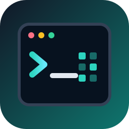

<p align="center">
  
</p>

<h1 align="center">Cheat Engine CLI</h1>

<p align="center"><strong>Native macOS and Windows process-memory workflows, plus remote Cheat Engine <code>ceserver</code> compatibility.</strong></p>

<p align="center">
  <a href="README.md">English</a> ·
  <a href="README.zh-CN.md">简体中文</a> ·
  <a href="https://github.com/chengyixu/cheat-engine-cli-skill">Agent Skill</a>
</p>

<p align="center">
  <a href="https://github.com/chengyixu/cheat-engine-cli/actions/workflows/cli.yml"></a>
  <a href="https://github.com/chengyixu/cheat-engine-cli/releases"></a>
  <a href="https://github.com/chengyixu/cheat-engine-cli"></a>
  <a href="https://chengyixu.github.io/cheat-engine-cli/"></a>
</p>

> [!IMPORTANT]
> **Independent project.** `cecli` is not an official Cheat Engine command-line edition. It interoperates with the upstream `ceserver` protocol and keeps the original Cheat Engine source in this repository for traceability. See [Notices and licensing status](NOTICE.md) before redistribution.

Cheat Engine CLI (`cecli`) is a cross-platform, JSON-first command-line interface for authorized process inspection and memory workflows. Run `cecli --native` on macOS to inspect macOS processes or on Windows to inspect Windows processes. Use `--endpoint` when connecting to an upstream Cheat Engine `ceserver` or the optional `cebridge` transport on another machine or VM.

## Why `cecli`?

| Need | Cheat Engine GUI | `cecli` |
|---|---:|---:|
| Interactive exploration | Excellent | Focused |
| Shell scripts and CI | Limited | Native |
| Stable JSON output | No | Default |
| Local macOS/Windows memory | Platform GUI | `--native` |
| Remote Linux/Android targets | Via `ceserver` | Via `ceserver` |
| AI-agent integration | UI automation required | Embedded rules, skills, and structured errors |
| Safe non-interactive writes | Manual workflow | `--dry-run`, `--yes`, and `--verify` |

## Highlights

- **Upstream protocol compatibility** — packet layouts are derived from `Cheat Engine/ceserver/ceserver.h`, `api.h`, and `networkInterface.pas`.
- **Native local memory access** — process discovery, regions, reads, exact scans, and guarded writes run in-process on macOS and Windows with `--native`.
- **Process inventory** — list processes, modules, threads, architecture, and mapped memory regions.
- **Typed memory reads** — decode signed/unsigned integers, floats, UTF-8, UTF-16LE, hex, or base64.
- **Portable exact scanner** — scan byte patterns with `??` wildcards or encoded values with alignment and protection filters.
- **Guarded memory writes** — fail closed without `--yes`; preview without connecting via `--dry-run`; verify with read-back.
- **Advanced target controls** — allocate/free memory, change page protection, load target-side modules, and set speed with the same confirmation contract.
- **Bounded debugger workflows** — collect a limited number of debug events, manage active-session hardware breakpoints, and inspect or replace validated raw thread contexts.
- **Remote administration** — inspect server paths/options and manage authorized target files with bounded transfers.
- **AI-native command contract** — JSON by default, stdout data only, structured stderr errors, stable exit codes, typed command help, field projection, quiet mode, `--brief`, agent rules, and local feedback.
- **Fast, single binary** — standard-library Go implementation with no runtime dependencies.

## Give your agent the playbook

The companion [Cheat Engine CLI Skill](https://github.com/chengyixu/cheat-engine-cli-skill) turns this command surface into a disciplined agent workflow: authorize, discover, map, read, scan, preview, confirm, verify, and restore. It includes English and Simplified Chinese guidance for native macOS, native Windows, and remote `ceserver` targets.

```bash
npx skills add chengyixu/cheat-engine-cli-skill@cheat-engine-cli -g -y --agent codex
```

The skill links back to this repository as its canonical CLI implementation and command reference.

## Quick start

### 1. Build the CLI

```bash
git clone https://github.com/chengyixu/cheat-engine-cli.git
cd cheat-engine-cli
make build
./bin/cecli --human --help
```

### 2A. Inspect a local macOS or Windows target

On Windows, build normally and add `--native` to local process and memory commands. On macOS, the Mach task APIs also require a debugger-signed CLI; the helper selects an installed Apple Development or Developer ID identity:

```bash
# macOS
make sign-macos-native
./bin/cecli --native server info --human
./bin/cecli --native process list --filter game --human

# Windows PowerShell
go build -o bin/cecli.exe ./cmd/cecli
./bin/cecli.exe --native process list --filter game --human
```

macOS may still deny SIP-protected or otherwise restricted processes. Windows may require an elevated terminal when the target runs at higher integrity.

Native mode currently covers server identity/path, process discovery, architecture, memory regions, bounded reads, portable exact scans, and confirmation-gated writes. Commands for remote files, pipes, modules, threads, debugger sessions, allocation, and protection changes remain `ceserver`-only.

### 2B. Connect to a remote target

Build and run the upstream server on an authorized Linux or Android target:

```bash
cd "Cheat Engine/ceserver/gcc"
make
sudo ./ceserver
```

The upstream default port is `52736`. Restrict network access with a host firewall or an authenticated tunnel.

### 3. Inspect a target

```bash
# Verify the selected target; add --native for this computer
./bin/cecli server info --human

# Find the target PID
./bin/cecli process list --filter game --human

# Inspect its memory map
./bin/cecli memory regions --pid 4242 --human

# Read a float
./bin/cecli memory read --pid 4242 --address 0x7FF612340120 --format typed --type f32

# Scan for a 32-bit value
./bin/cecli memory scan --pid 4242 --type i32 --value 100 --alignment 4 --protection writable
```

## Safe write workflow

```bash
# Preview: no server connection and no mutation
./bin/cecli memory write \
  --pid 4242 \
  --address 0x7FF612340120 \
  --type i32 \
  --value 999 \
  --dry-run

# Execute only after reviewing PID, address, and encoded bytes
./bin/cecli memory write \
  --pid 4242 \
  --address 0x7FF612340120 \
  --type i32 \
  --value 999 \
  --yes \
  --verify
```

`cecli` never prompts for missing input. A write without `--yes` exits with code `2` and emits a machine-readable error on stderr.

## JSON-first output

```bash
cecli process list | jq '.data.processes[] | select(.name | test("game"; "i"))'
```

Every successful agent-mode response includes:

```json
{
  "ok": true,
  "command": "process list",
  "data": {},
  "meta": {"version": "0.1.0"},
  "rules": [],
  "skills": [],
  "issue": {}
}
```

Errors are written only to stderr:

```json
{
  "error": true,
  "code": "CONFIRMATION_REQUIRED",
  "message": "memory write refused without --yes",
  "suggestion": "Inspect the command with --dry-run, then repeat with --yes and preferably --verify."
}
```

Agents can ask for one exact command contract, select only needed fields, or suppress all output when the exit code is sufficient:

```bash
cecli memory scan --help --pretty | jq '.data.commands[0]'
cecli version --fields name,version
cecli self-check --quiet
```

Machine-readable help includes `schema_version`, CLI version, typed parameters, defaults, enums, conditional constraints, and success/error envelope schemas. `--fields` accepts dotted paths and reports unavailable selections in `meta.missing_fields`; `--quiet` suppresses both stdout and stderr without changing the exit code.

## Commands

| Command | Purpose |
|---|---|
| `cecli server info` | Show protocol version, server name, ABI, and endpoint. |
| `cecli server connection-name` | Set the current connection’s diagnostic server-log name. |
| `cecli server terminate` | Preview or explicitly terminate the remote server. |
| `cecli process list` | List and filter visible processes. |
| `cecli process info --pid` | Show architecture plus module/thread counts. |
| `cecli process speed --pid --speed` | Preview or change target speed. |
| `cecli module list --pid` | List mapped modules and addresses. |
| `cecli module load|load-ex|extension-load` | Preview or load target modules and the ceserver extension. |
| `cecli thread list --pid` | List target thread IDs. |
| `cecli thread suspend|resume --pid --tid` | Change an active debugger session’s thread suspend count. |
| `cecli thread create|close` | Create a remote thread or close its returned handle. |
| `cecli debug trace --pid` | Attach for a bounded event trace, continue each event, then detach. |
| `cecli debug breakpoint set|remove` | Manage hardware breakpoints in an active debug session. |
| `cecli debug context get|set` | Export or replace a validated raw thread-context blob. |
| `cecli memory regions --pid` | Enumerate memory regions and protections. |
| `cecli memory read --pid --address` | Read raw or typed memory. |
| `cecli memory scan --pid` | Scan exact bytes or typed values. |
| `cecli memory aobscan --pid` | Explicitly invoke the patched experimental server-side AOB packet. |
| `cecli memory write --pid --address` | Preview or perform a guarded write. |
| `cecli memory alloc|free|protect` | Manage target allocations and page protection. |
| `cecli server path|options` | Inspect paths and runtime server options. |
| `cecli remote ls|stat|get|put|mkdir|rm|chmod` | Inspect or mutate the authorized target filesystem. |
| `cecli pipe open|read|write|close` | Exchange bounded data through ceserver named pipes. |
| `cecli symbol list --path` | Read and filter compressed ELF symbols. |
| `cecli skills [name]` | Discover embedded agent workflows. |
| `cecli issue create|list|show|transition` | Record structured local feedback. |
| `cecli completion bash|zsh|fish` | Generate shell completion source. |
| `cecli self-check` | Validate embedded contracts and local state. |

See the complete [command reference](docs/command-reference.md) and [architecture](docs/architecture.md).

## Configuration

Precedence is command flag, environment variable, then default.

| Setting | Flag | Environment | Default |
|---|---|---|---|
| Native local target | `--native` | `CECLI_NATIVE=true` | Disabled |
| `ceserver` endpoint | `--endpoint` | `CECLI_ENDPOINT` | `127.0.0.1:52736` |
| Connection name | `--connection-name` | `CECLI_CONNECTION_NAME` | Unset |
| Network timeout | `--timeout` | `CECLI_TIMEOUT` | `30s` |
| Output mode | `--human` / `--agent` | `CECLI_OUTPUT=human` | JSON |
| Selected JSON fields | `--fields path,...` | `CECLI_FIELDS` | All command data |
| Silent execution | `--quiet` / `-q` | — | Disabled |
| Local issue state | — | `CECLI_STATE_DIR` | Platform user config directory |

## Build and test

```bash
make check      # go test ./... + go vet ./...
make race       # race detector
make smoke      # build + JSON contract smoke tests
make sign-macos-native # build and debugger-sign the macOS CLI
make snapshot   # local GoReleaser snapshot
make snapshot-darwin # cgo-enabled arm64 + x86_64 macOS archives
```

Darwin release archives are built on a macOS runner with CGO enabled and include `scripts/sign-macos-native.sh`. Signing is intentionally performed on the user or distributor machine because debugger-entitled binaries require an appropriate local Apple signing identity.

The test suite includes a fake TCP `ceserver` that verifies packed request widths and responses for process/module/thread enumeration, regions, reads, writes, client/server scans, connection naming, server termination, debugger events, breakpoints, contexts, extension controls, named pipes, remote files, and compressed symbols. No privileged live process is required for unit tests.

## Current scope

Remote mode covers every non-obsolete command dispatched by the bundled upstream `ceserver`, including connection naming, guarded remote termination, and the server-side AOB packet. Native macOS and Windows mode currently covers the process and memory operations needed for discovery, regions, reads, portable exact scans, and guarded writes. The safer portable scanner remains the default; `memory aobscan` exists for explicit remote packet compatibility and requires `--yes`.

## Responsible use

Use this software only on systems, applications, games, and processes you own or are explicitly authorized to inspect. Process memory can contain credentials, personal information, cryptographic material, and proprietary data. Keep `ceserver` off untrusted networks.

## FAQ

### What is Cheat Engine CLI?

Cheat Engine CLI is an independent command-line interface with native macOS and Windows process-memory access plus compatibility with the upstream Cheat Engine `ceserver` protocol. It is designed for authorized debugging, interoperability testing, modding, research, CI, and AI-agent workflows.

### Does `cecli` replace the Cheat Engine GUI?

No. The GUI remains better for interactive disassembly, table editing, debugger workflows, and visual exploration. `cecli` focuses on deterministic local or remote inspection, exact scans, typed reads, guarded writes, and automation.

### Does it work locally without `ceserver`?

Yes on macOS and Windows. Add `--native` to inspect eligible processes on the same operating system without starting `ceserver`. Remote Linux and Android targets continue to use `ceserver`; native Linux access remains a roadmap item.

### Is memory writing enabled by default?

No. The command refuses writes without `--yes`; `--dry-run` performs no connection or mutation, and `--verify` compares read-back bytes.

### Is this an official Cheat Engine project?

No. It is an independent project based on protocol compatibility with the upstream source.

## Roadmap

- Native local-process backend for Linux.
- Scan sessions with unknown-initial-value and changed/unchanged refinement.
- Pointer scan workflows and reusable address tables.
- Symbol-name lookup and module-relative address expressions.
- Architecture-aware register decoding and one-command breakpoint trace orchestration.
- MCP schema export and package-manager distribution after repository licensing review.

## Upstream attribution

This repository began as a full clone of [cheat-engine/cheat-engine](https://github.com/cheat-engine/cheat-engine). The upstream project describes Cheat Engine as a development environment focused on modding games and applications for personal use. Original source, history, and bundled component notices remain present.

## Notices

The cloned upstream tree does not currently include a repository-wide detected license. Read [NOTICE.md](NOTICE.md) before redistribution. Security guidance is in [SECURITY.md](SECURITY.md).
